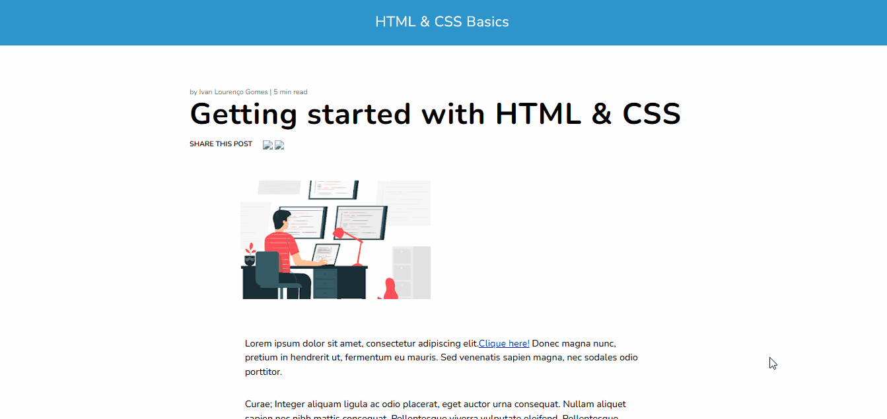

# ✨ Minha primeira página da web (My first web page) ✨

## 📝 Descrição do projeto:
Página da web simples, desenvolvida como um dos exercícios práticos do curso de Web Design Completo do professor Ivan Lourenço Gomes na plataforma da Udemy💜. Esse projeto foi feito com foco em praticar a estruturação semântica, organização de estilos e um layout visualmente agradável.

⚠ O conteúdo exibido na página é um texto fictício, em latim, utilizado em design gráfico e editoração para preencher espaços de texto em projetos, como jornais, revistas ou sites. O foco está exclusivamente na estrutura e no estilo da interface.

## 🚀Tecnologias usadas:
 

## 💡 Funcionalidades:
- Design simples e organizado;
- Estrutura semântica.

## 🖼️ Demonstração:

Você também pode acessar a página online clicando ✨<a href="https://my-first-web-page-iota.vercel.app/">aqui</a>✨

## 👩‍💻 Autora:
Feito por ✨[Nathália Anastácio](https://github.com/nath-anastacio)✨
### 💬 Você pode me encontrar em:

  
  

